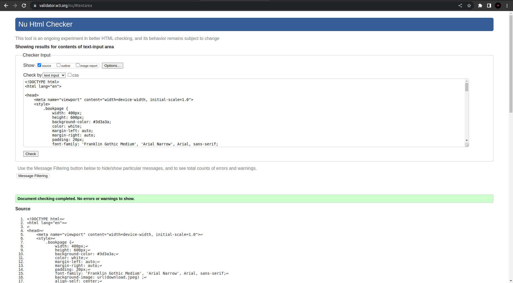
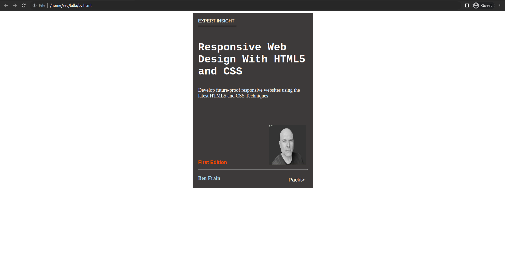

# Book CoverPage Design

## AIM:

To design a static web site for a book cover page.

## DESIGN STEPS:

### Step 1:
Create a HTML file.


### Step 2:
Include CSS in the head.


### Step 3:
Add styles using CSS.


### Step 4:
Include the html code in the body.


### Step 5:
Close all the opened tags.


### Step 6:

Validate the HTML and CSS code.

### Step 6:

Publish the website in the given URL.

## PROGRAM :
```HTML
<!DOCTYPE html>
<html lang="en">

<head>
    <meta name="viewport" content="width=device-width, initial-scale=1.0">
    <style>
        .bookpage {
            width: 400px;
            height: 600px;
            background-color: #3d3a3a;
            color: white;
            margin-left: auto;
            margin-right: auto;
            padding: 20px;
            font-family: 'Franklin Gothic Medium', 'Arial Narrow', Arial, sans-serif;
            background-image: url(download.jpeg) align;
            align-self: center;
            background-size: cover;
        }

        .toptext {
            color: white;
        }

        .tophr {
            width: 140px;
        }

        .author {
            color: white;
            display: inline;
            position: relative;
            color: lightblue;
            top: 190px;
            font-family: Georgia;
            font-size: medium;
        }

        .booktitle {
            font-family: 'Courier New', Courier, monospace;
            font-size: larger;
            text-align: center;
            position: relative;
            top: 30px;
        }

        .id {
            width: 400px;
            position: relative;
            top: 190px;
        }

        .publisher {
            font-size: larger;
            position: relative;
            top: 155px;
            left: 330px;
        }

        .edition {
            color: rgb(255, 72, 0);
            font-size: large;
            font-family: 'Franklin Gothic Medium', 'Arial Narrow', Arial, sans-serif;
            position: relative;
            top: 70px;
        }

        .subtitle {
            font-family: Tahoma;
            font-size: large;
            position: relative;
            top: 40px;
        }

        .photo {
            position: relative;
            top: 135px;
            left: 260px;
            width: 100px;
            height: 100px;
            background-size: cover;
        }
    </style>
    <title>Book Cover Page</title>
</head>

<body>
    <div class="bookpage">
        <div class="toptext">
            EXPERT INSIGHT
        </div>
        <div class="tophr">
            <hr style="color: red;">
        </div>
        <div class="booktitle">
            <h1 align="left">Responsive Web Design With HTML5 and CSS </h1>
        </div>
        <div class="subtitle">
            Develop future-proof responsive websites using the latest HTML5 and CSS
            Techniques
        </div>
        <div class="photo">
            
        </div>
        <div class="id">
            <hr style="color: orange;">
        </div>
        <div class="author">
            <h3><b>Ben Frain</b></h3>
        </div>
        <div class="publisher">
            Packt>
        </div>
        <div class="edition">
            <b>First Edition</b>
        </div>
    </div>
</body>

</html>

```


## OUTPUT:



## Result:
Thus, a static web site for a book cover page is designed.

